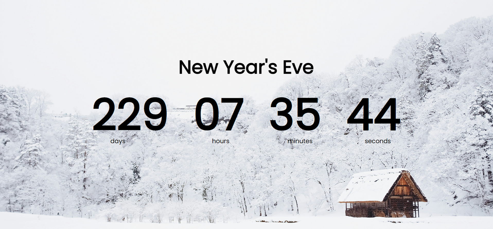

# 🎉 Countdown Timer

A responsive and visually appealing **Countdown Timer** web app that displays the time remaining until a specified date. This project uses **HTML, CSS, and JavaScript** to create a real-time countdown experience — perfect for events like New Year’s Eve, birthdays, launches, and more!

 <!-- Add a screenshot image in your project root -->

---

## 📌 Features

- ⏳ Real-time countdown to any target date
- 🕒 Days, hours, minutes, and seconds displayed
- 🎨 Beautiful background with stylish font and layout
- 📱 Fully responsive for mobile and desktop
- 🔁 Updates every second using `setInterval`

---

## 🛠️ Tech Stack

- **HTML5** – Structure of the webpage
- **CSS3** – Styling with background image and modern typography
- **JavaScript (Vanilla)** – Real-time countdown logic

---

## 📂 Project Structure
countdown-timer/
├── index.html # Main HTML structure
├── style.css # Styles and responsive layout
├── script.js # Countdown logic in JS
├── bg.jpg # Background image
├── screenshot.png # Project screenshot (optional)
└── README.md # Project documentation


---

## 🧠 How It Works

1. JavaScript fetches the current time and the target countdown date.
2. Calculates the time difference in seconds.
3. Converts total seconds into days, hours, minutes, and seconds.
4. Dynamically updates the DOM every second to display the remaining time.

---

### ✅ What to do now:
- Replace `[Your Name]` with your actual name or GitHub username.
- Add `screenshot.png` to show a preview of your project.
- Replace the live demo link with a GitHub Pages, Netlify, or Vercel URL if you deploy it.

Let me know if you'd like a GitHub commit-ready folder or help deploying it online!

Made with ❤️ by [ShaunBoeing787]

## 🖼️ Customization

### 🎯 Change the countdown target:

In `script.js`, update this line:
```js
const newYear = "18 May 2025";
---

body {
  background-image: url(./bg.jpg); /* Replace with your custom image */
}


